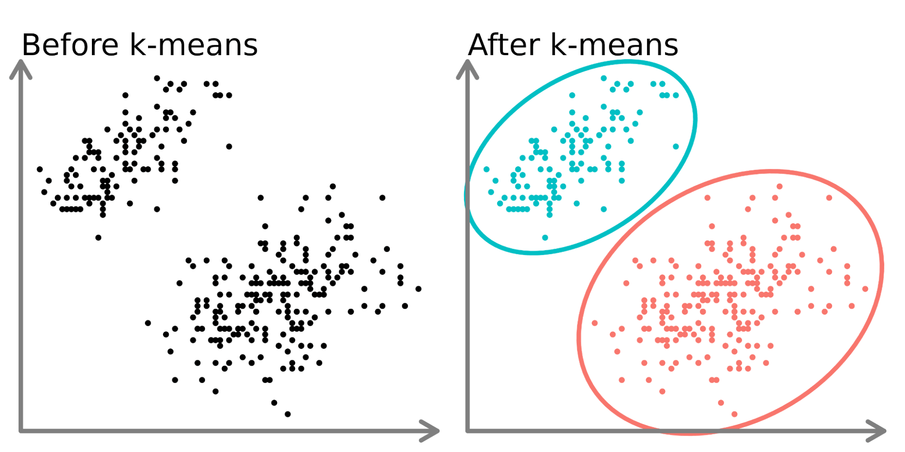
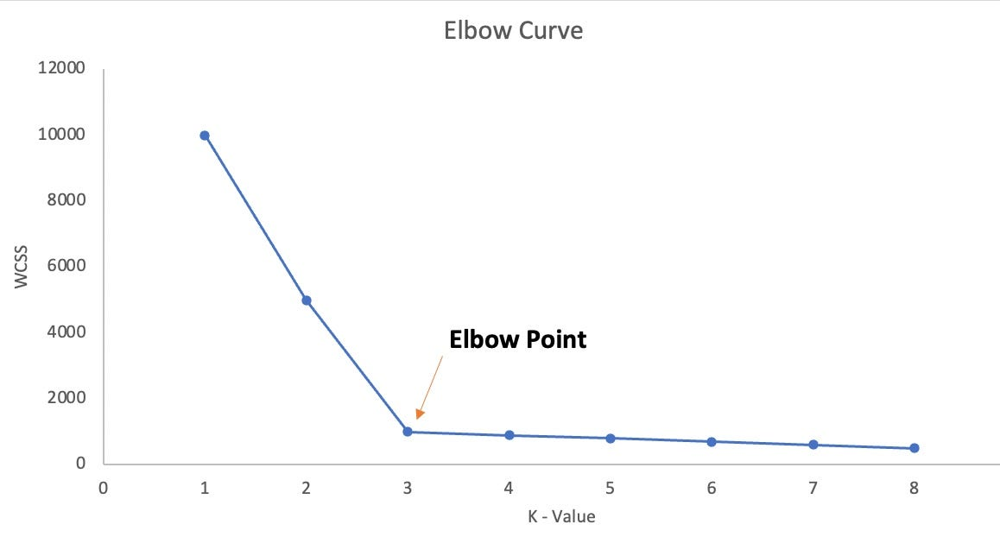
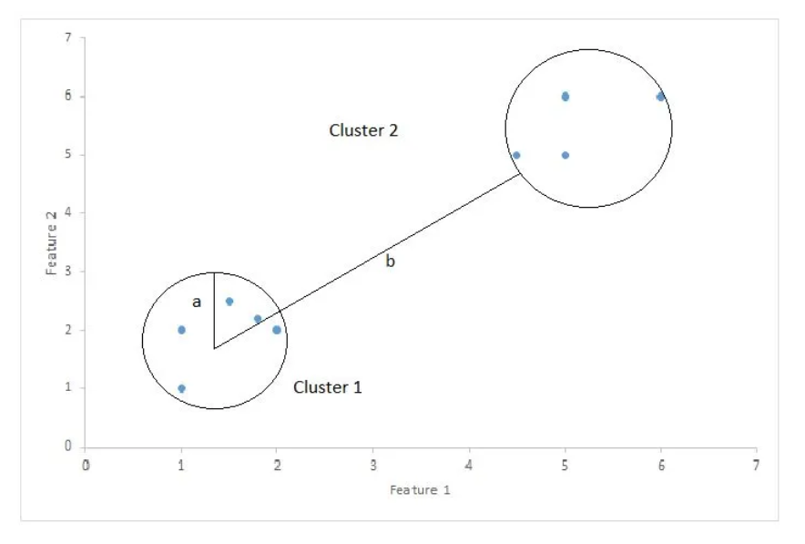

# K-Means Clustering

K-Means Clustering is an unsupervided machine learning model, that belongs to the class of clustering algotithms.

## Clustering Algorithms

Clustering Algorithms seek to learn from the properties of the data, an optimal division or discrete labeling of groups of points. The goal is to find groups of points that are similar to each other, but different from the points belonging to other groups.

## K-Means

The k-means algorithm objective is for search a predetermined number of cluster within an unlabeled multidimensional dataset. Thus finding the optimal division of the dataset into k groups (clusters).

We can define a optimal cluster if it satisfies the following conditions:

- the cluster center is the mean of all points belonging to the cluster
- each point is closer to its own cluster center than to other cluster centers

### Example

Here we have a dataset with obivious 2 clusters, and the k-means algorithm is able to find this clusters.

## Expectation–Maximization (EM) Algorithm

The k-means algorithm NP-Hard, so it is not possible to find the optimal solution in a reasonable amount of time. So, the k-means algorithm uses a heuristic approach to find a solution.

The k-means algorithm is a particular case of the Expectation–Maximization (EM) Algorithm, that is a general approach to learning in the presence of unobserved variables.

The approach consists in iteratively computing two steps:

- E-step: determine the expected value for the unobserved variables, given the current model parameters
- M-step: determine the maximum-likelihood model parameters, given the current expected values of the unobserved variables

Using this is k-means algorithm:

1. Randomly choose k points as cluster centers.
2. Repeat until converged (i.e. cluster center assignments no longer change)):
   1. (E-step) Assign each data point to the closest cluster center. (Find the distance between each point and each cluster center, and assign each point to the closest cluster center)
   2. (M-step) Update cluster centers to be the mean of all points assigned to that cluster.

## How to choose the number of clusters

The k-means algorithm requires the number of clusters to be specified. But, how to choose the number of clusters?

The best choice will depend on the particular dataset and the particular goals of any analysis. But, there are some approaches that can help us to choose the number of clusters.

### Elbow Method

The elbow method is a heuristic method to find the optimal number of clusters. It consists in plot the sum of squared distances of samples to their closest cluster center for different values of k. The optimal number of clusters is the value of k after which the sum of squared distances start to decrease in a linear fashion.

### Silhouette Analysis

The silhouette analysis is a method to validate the goodness of a clustering technique, to get this metric we need to calculate the silhouette coefficient for each sample.

The silhouette coefficient is a measure of how similar an object is to its own cluster (cohesion) compared to other clusters (separation). The silhouette ranges from −1 to +1, where a high value indicates that the object is well matched to its own cluster and poorly matched to neighboring clusters.

Where Silhouette Score is (b -a)/max(a, b);

- a: mean distance between a sample and all other points in the same class.
- b: mean distance between a sample and all other points in the next nearest cluster.

As much next to 1 the score is better the clustering is.

#### Silhouette Analysis on K-Means clustering

You can use this to validate if the K is a good number of clusters to use.

## Limits of k-means

### Nonlinear boundaries

K-means not work well handle with complicated geometries. It is not able to find non-linear boundaries between clusters. So, it is not able to find complex shapes.

To solve this problem, we can use other clustering algorithms, like Gaussian mixture models (GMM). But in Sklearn we have a kernelized k-means, that is able to find non-linear boundaries between clusters creating a high-dimensional projection of the data called `SpectralClustering`.

### Large Number of samples

Because k-means use the EM algorithm, and have to access every sample at each iteration, the algorithm does not scale well to large number of samples.

The alternative is to use a subset of the data to find the cluster centers, and then use these cluster centers to assign labels to the full dataset. This is the idea behind the batch-based k-means algorithm, implemented in `sklearn.cluster.MiniBatchKMeans`.

### References

1. [StatQuest: K-means clustering](https://youtu.be/4b5d3muPQmA?si=HrubssPSAWuuN3Un)
2. Python Data Science Handbook - Jake VanderPlas - Cap 47 - In Depth: k-Means Clustering
3. [Silhouette Coefficient: Validating Clustering Techniques](https://towardsdatascience.com/silhouette-coefficient-validating-clustering-techniques-e976bb81d10c)
