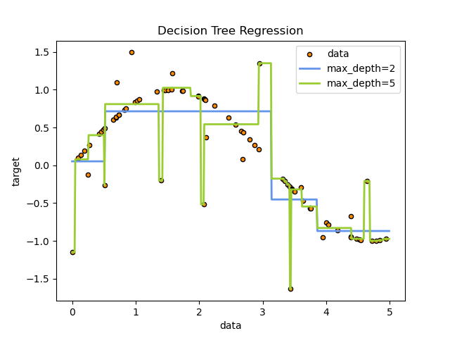

Decision trees are a popular machine learning algorithm used for classification and regression tasks. They are easy to interpret and visualize, making them a popular choice for decision-making tasks.

## Sumary

- Theory
- Pruining
- Random Forest

## Theory

The algorithm works by create a tree structure where each node represents a feature and each branch represents a decision. The tree is built by recursively splitting the data based on the feature that best separates the data into different classes.

The training is to find the best feature to split the data at each node. The best feature is the one that maximizes the information gain, which is a measure of how much the feature reduces the uncertainty in the data.

The result of the algorithm is a tree structure that can be used to make predictions on new data. To make a prediction, we start at the root node and follow the branches until we reach a leaf node, which contains the class label.
