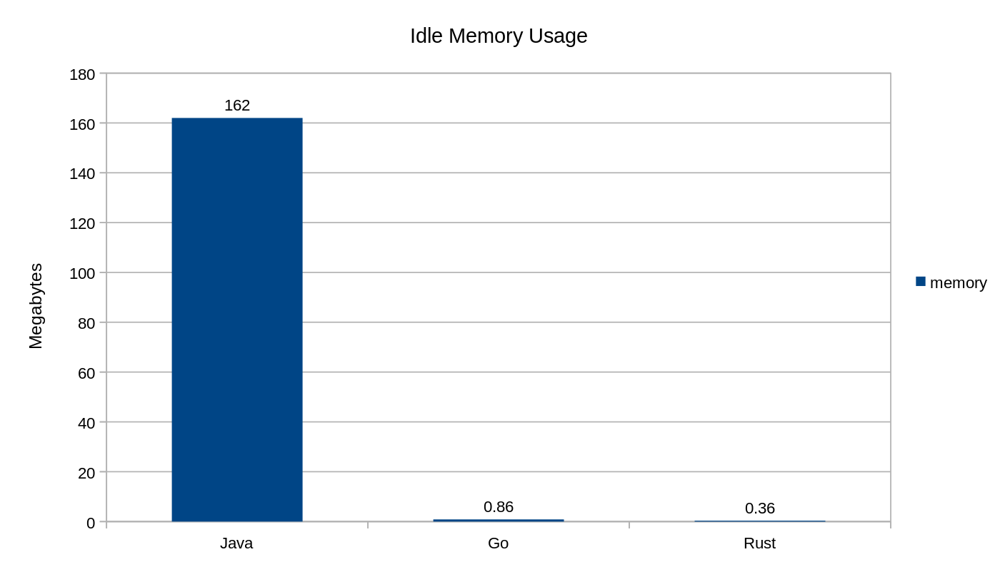

# Go

This section contains my notes taken from the course [Go Programming – Golang Course with Bonus Projects](https://www.youtube.com/watch?v=un6ZyFkqFKo&ab_channel=freeCodeCamp.org)

## Why Go?

- Go is a compiled language that because of it has a execution time much faster than interpreted languages like Python/Javascript. Alongside has a much faster compile time compared to other compiled languages like C++/Java/Rust. The execution time is comparable to Java/C#.
- Go compile to a single binary file that can be executed in any machine without the need of a runtime like Java or
C#.
- Go is strongly typed so it's easier to catch bugs at compile time.
- Every Go compiled program has a small extra code called Go Runtime that is responsible for garbage collection and other things. This runtime is very small compared to other languages like Java/C#.

## A Note on the structure of a Go program

We'll go over this all later in more detail, but to sate your curiosity for now, here are a few tidbits about the code.

1. `package main` lets the Go compiler know that we want this code to compile and run as a standalone program, as opposed to being a library that's imported by other programs.
2. `import fmt` imports the fmt (formatting) package. The formatting package exists in Go's standard library and lets us do things like print text to the console.
3. `func main()` defines the main function. main is the name of the function that acts as the entry point for a Go program.
