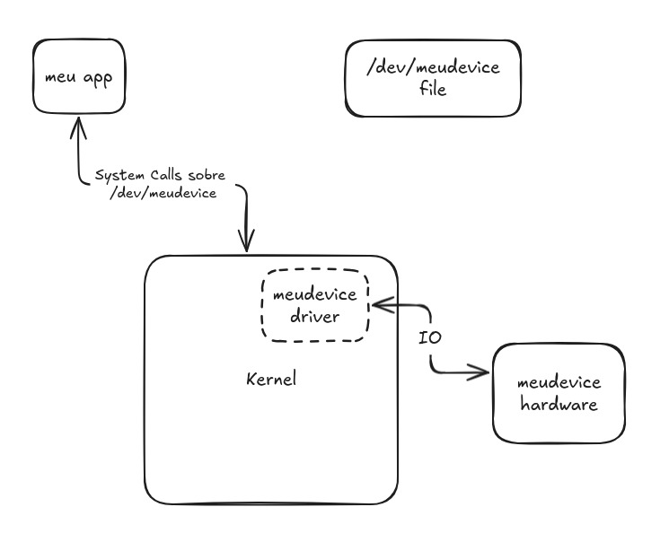

A driver is a piece of software that allows the operating system to communicate with hardware devices. It acts as a translator between the hardware and the software, allowing the operating system to send commands to the hardware and receive data from it.