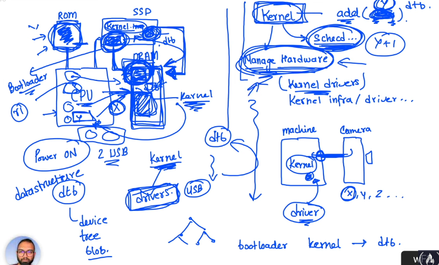

The Linux kernel is the core of the Linux operating system. It is responsible for managing hardware resources, scheduling processes, and providing a secure environment for applications to run.

The kernel is a abstraction layer between the hardware and the software. It is the first program that runs when the computer is turned on.

The kernel has
The kernel has:

- scheduler to manage the processes on cpu
- manages the hardware (kernel drivers, kernel infrastructure)

Every hardware conects to the machine needs to be know by the kernel. The code that does this is called a driver.

### Where is stored?

In the hard drive, in the /boot folder.

### Boot

When the computer is turned on, the bios loads the bootloader in the ram, which loads the kernel in the ram. The bios is stored in a chip in the motherboard (rom). The bootloader and the kernel is stored in the hard drive.

The kernel came with some basics drivers, like the keyboard and the screen.

### DTB (Device Tree Blob)

The kernel needs to know the hardware that is connected to the machine. The DTB is a datastructure file that contains the information about the hardware.

The bootloader loads the kernel and the DTB in the ram.

## Privileged Mode

The kernel runs in privileged mode, which means it has access to all the hardware resources and can execute any instruction. User programs run in user mode, which restricts their access to hardware resources and system calls.

The user programs needs to ask the kernel to do something for them. This is done by system calls.

The CPU has EL0, EL1, EL2 and EL3 modes. The kernel runs in EL1 and the user programs in EL0.

EL0 is the least privileged mode, and EL3 is the most privileged mode.

EL0 can't access some cpu registers and can't execute some instructions.

## System Calls

System calls are the api interface between the user programs and the kernel. The kernel provides a set of system calls that user programs can use to request services from the kernel.

This calls are a bunch of actions that are common or generic like read and write on buffer.

It's expected that the kernel will provide a set of system calls. Some device drivers implements system calls too.

## Loadable Kernel Modules

The kernel can be extended with loadable kernel modules. These are pieces of code that can be loaded and unloaded from the kernel at runtime.
