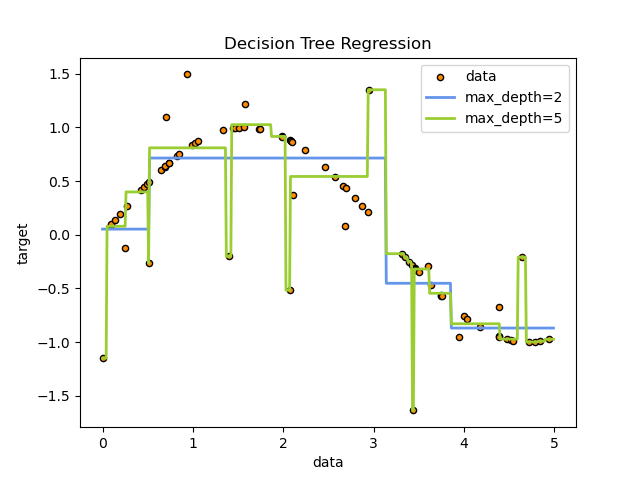

Decision trees are a popular machine learning algorithm used for classification and regression tasks. They are easy to interpret and visualize, making them a popular choice for decision-making tasks.

# Sumary

- Teory
- Pruining
- Random Forest
