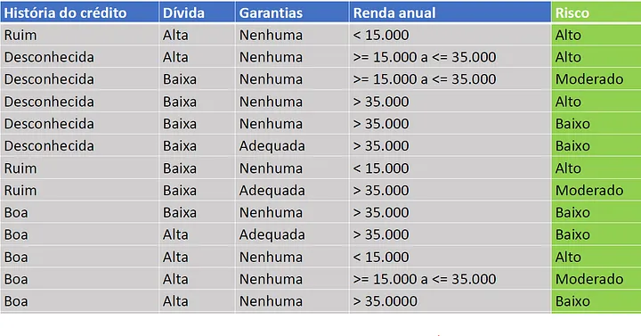
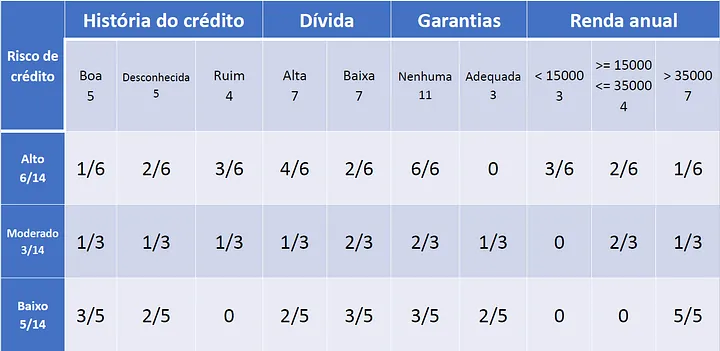
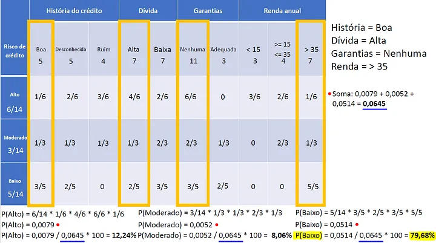

1. We create a probability table for each class.
2. We calculate the prior probabilities for each class.

Given this dataset:

Our wanted variable is "Risco", so we have to calculate the probabilities for each class.

The prior probabilities are:

Here we have a example, the probability of "Risco" being "Alto" is 6/14, then goes on.
The probability of "História de crédito" be "Boa" and "Risco" be "Alto" is 1/6.
This is done for all the classes.

If this table, we can estimate the probability of a new instance being in a class. We just need to multiply the probabilities of the features for that class.

The result is the most probable class!

This is the basic idea behind Naive Bayes. It is simple and fast, and it is often used as a baseline for comparison with other more complex algorithms.

## Problems

Sometimes the probability can be zero. This can be a problem because it will make the final probability zero. To solve this, we can use Laplace smoothing. This is a technique that adds a small value to the probability to avoid zero probabilities.
This is done by adding 1 to the numerator and the number of classes to the denominator. As we are inserting new data into the model, the probability will be adjusted, this can be a problem because the model can be biased.

## apriori and posteriori probabilities

We use apriori probabilities to calculate the probability of a new instance being in a class. This is done by multiplying the probabilities of the features for that class. The result is the posteriori probability.

## pros

- Simple and fast
- Good for small datasets

## cons

- Assumes that the features are independent (which is not always true) (example: debt and income can be related, but Naive Bayes assumes they are not)
