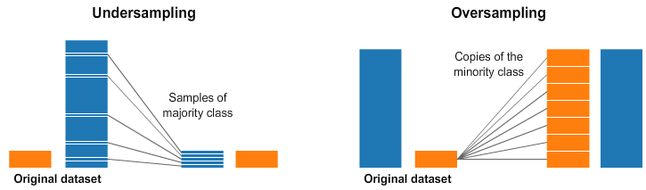
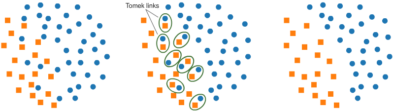
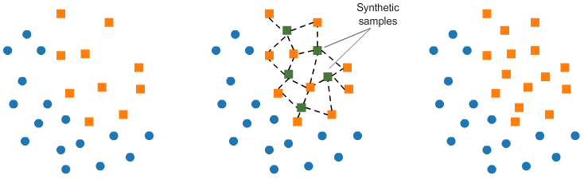

Resampling is a technique used to address imbalanced datasets, where one class is significantly more frequent than the other. This can lead to biased models that perform poorly on the minority class. Resampling methods aim to balance the dataset by either oversampling the minority class or undersampling the majority class.

### Undersampling

- **Tomek Links**: Remove the majority class examples that are close to the minority class examples.



```python
from imblearn.under_sampling import TomekLinks

# Create the resampling object
tl = TomekLinks(sampling_strategy='all') # all, majority, minority

# Fit the resampling object to the training data
X_under, y_under = tl.fit_resample(X_train, y_train)
```

### Oversampling

- **SMOTE (Synthetic Minority Over-sampling Technique)**: Generate synthetic examples for the minority class by interpolating between existing examples.



```python
from imblearn.over_sampling import SMOTE

# Create the resampling object
smote = SMOTE(sampling_strategy='minority') # all, minority, majority

# Fit the resampling object to the training data
X_over, y_over = smote.fit_resample(X_train, y_train)
```

## References

[Resampling strategies for imbalanced dataset](https://www.kaggle.com/code/rafjaa/resampling-strategies-for-imbalanced-datasets)
